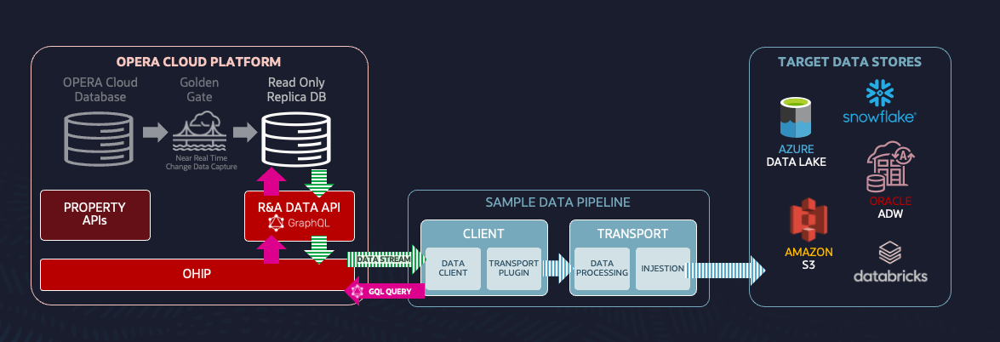

# R&A Data API Fetching Client 🚀

Sample GraphQL data fetching client for retrieving and processing structured profile information from the R&A Data API.

> ⚠ **Important**: This is **NOT** an official Oracle API client. It is a **sample client** built for demo purposes. Use it at your own risk.

📌 **Table of Contents**

- [R\&A Data API Fetching Client 🚀](#ra-data-api-fetching-client-)
  - [Features ✨](#features-)
  - [Architecture 🏗️](#architecture-️)
  - [Installation 🛠](#installation-)
  - [Configuration ⚙️](#configuration-️)
  - [Run ▶️](#run-️)
  - [Plugin Authoring 🔌](#plugin-authoring-)
  - [GraphQL Details ✏️](#graphql-details-️)
  - [Advanced Configuration ⚙️](#advanced-configuration-️)
  - [Troubleshooting \& Logs 🐞](#troubleshooting--logs-)
  - [Contributing \& Support 🤝](#contributing--support-)
  - [License 📜](#license-)
  - [Disclaimer ⚠️](#disclaimer-️)

## Features ✨

- 🚀 Loads connection parameters from environment variables
- 🔄 Automatically refreshes OAuth tokens before expiration
- 📡 Supports GraphQL queries with request/response or request/stream modes
- 📥 Enables streaming mode if `@stream` directive is present
- 🗑 Filters out null values from responses (optional)
- 📂 Saves fetched data in structured JSON files
- 📑 Logs execution details at different levels (info, debug, silly)
- 🔧 Supports dynamic query files and filter variables from an external file
- 🔌 Custom plugins (`./src/plugins`) for stream processing - `fileWriter.ts` provided as sample

## Architecture 🏗️

Below a conceptual architecture diagram illustrating the workflow of this client:



## Installation 🛠

- Install Node.js:

  It is recommended to use [Node Version Manager (nvm)](https://github.com/nvm-sh/nvm) for managing Node versions:

  ```bash
  NODE_VERSION=v20.11.0
  nvm install $NODE_VERSION
  nvm alias default $NODE_VERSION
  nvm use default
  ```

- Install project dependencies:

  ```bash
  npm install
  ```

## Configuration ⚙️

Before running the application, set the required environment variables. If testing locally, these can be stored in an `.env` file:

```bash
  touch .env
```

Here are the essential environment variables and their purpose:

- 🌍 **APIGW_URL**: The API Gateway URL for accessing Oracle Hospitality APIs. Example:
  ```bash
  APIGW_URL=https://your-api-gateway-url
  ```

- 🔑 **APP_KEY, CLIENT_ID, CLIENT_SECRET**: Credentials required for authentication. Example:
  ```bash
  APP_KEY=your-app-key
  CLIENT_ID=your-client-id
  CLIENT_SECRET=your-client-secret
  ```

- 🏢 **ENTERPRISE_ID**: The enterprise identifier related to the customer environment. Example:
  ```bash
  ENTERPRISE_ID=your-enterprise-id
  ```

- 🗑 **EXCLUDE_NULL**: Set to `true` to remove null values from responses. Example:
  ```bash
  EXCLUDE_NULL=true
  ```

- 📝 **PLUGIN_NAME**: Specifies which plugin should be used for processing data streams. Example:
  ```bash
  PLUGIN_NAME=fileWriter
  ```

- 🔍 **QUERY_NAME & FILTER_NAME**: Define which query and filter files (from `./queries` and `./filters`) should be used. Example:
  ```bash
  QUERY_NAME=profileIndividuals
  FILTER_NAME=profileIndividuals
  ```

- 🔄 **FILTER_VARS**: Defines dynamic variables for filters. Any placeholder like `{{var}}` in the filter file will be replaced with the specified values. Example:
  ```bash
  FILTER_VARS=hotelId:HOTEL123,limit:100
  ```

- 📝 **LOGLEVEL**: Defines the log verbosity level (`silly`, `trace`, `debug`, `info`, `warn`, `error`, `fatal`). Example:
  ```bash
  LOGLEVEL=info
  ```

> ℹ️ To use an environment file other than `.env`, set the `ENVPATH` variable, e.g., `export ENVPATH=./dev.env`.

## Run ▶️

Once all required environment variables are set, the project can be executed with:

```bash
npm start
```

 To run in development mode:

 ```bash
 npm run dev
 ```

## Plugin Authoring 🔌

You can extend or customize how streamed GraphQL chunks are processed by dropping your own plugin modules under `src/plugins/`. Each plugin module should export a default function named `processChunk` with this signature:

```ts
// src/plugins/myPlugin.ts
export default function processChunk(
  chunk: any,
  config: { fileName: string; outDir: string; [key: string]: any }
): void {
  // your processing logic here
}
```

- `chunk` is the parsed JSON for each incremental payload  
- `config.fileName` is the base name of the query being executed  
- `config.outDir` is the directory where plugins typically write output  
- You can add additional keys to `config` as needed

To enable your plugin, set `PLUGIN_NAME` to the module filename (without extension). Example:

```bash
PLUGIN_NAME=myCustomPlugin
```

## GraphQL Details ✏️

Queries live in `queries/*.gql` and must be valid GraphQL operations. The client supports two modes:

1. Standard request/response  
   - Any query without the `@stream` directive will be sent via ApolloClient and return a complete response object.
2. Streaming mode  
   - Annotate a list field in your query with `@stream` (and optional args like `initialCount`).  
   - Example:

    ```graphql
    query ListProfiles {
      profileIndividuals @stream(initialCount: 50) {
        id
        name {
          given
          family
        }
      }
    }
    ```
   - Chunks are processed as they arrive, passed to your `processChunk` plugin.

Filters are JSON templates with placeholder syntax `{{variableName}}`. These are replaced at runtime based on the `FILTER_VARS` env var (e.g. `hotelId:HOTEL123,limit:100`).

## Advanced Configuration ⚙️

Beyond the core env vars, you can override:

- `OAUTH_ENDPOINT` – Path for token fetch (default `/oauth/v1/tokens`)
- `DATA_ENDPOINT`  – Path for GraphQL API (default `/rna/v1/graphql`)
- `TOKEN_EXPIRY`   – Milliseconds before the client refreshes the OAuth token
- `QUERY_FOLDER`, `FILTER_FOLDER`, `PLUGIN_FOLDER` – Paths to custom folders
- `ENVPATH`        – Path to your env file if not `.env`

## Troubleshooting & Logs 🐞

- Increase verbosity via `LOGLEVEL` (`trace` or `silly`) to see HTTP requests and chunk parsing.
- Common errors:
  - **Missing env vars**: The client will throw if `QUERY_NAME` or `FILTER_NAME` isn’t set.
  - **Variable replacement**: You’ll see an error if any `{{…}}` placeholder isn’t provided in `FILTER_VARS`.
  - **Authentication failures**: Invalid credentials return 401/403; check `CLIENT_ID`, `CLIENT_SECRET`, and `APP_KEY`.
  - **Network timeouts**: Increase `TOKEN_EXPIRY` or adjust timeouts in `Call.ts` if needed.

Logs are printed to stdout; make sure your console or container captures them.

## Contributing & Support 🤝

Contributions are welcome! To get involved:

- Fork the repo and create branches against `main`.
- Open issues for bugs or feature requests.
- Submit PRs with clear descriptions and minimal focused changes.
- Run `npm install`, then:
  - `npm run lint` to check code style.
  - `npm run dev` to test in watch mode.

Please adhere to existing TypeScript conventions and update this README for any new features you add.
## License 📜

This project is available under the [Universal Permissive License v 1.0](https://oss.oracle.com/licenses/upl).

See [LICENSE](LICENSE.txt) for details.

## Disclaimer ⚠️

This is **NOT** an official Oracle product. It is provided for demonstration purposes only, without any guarantees of reliability, accuracy, or completeness. Use it at your own risk.

